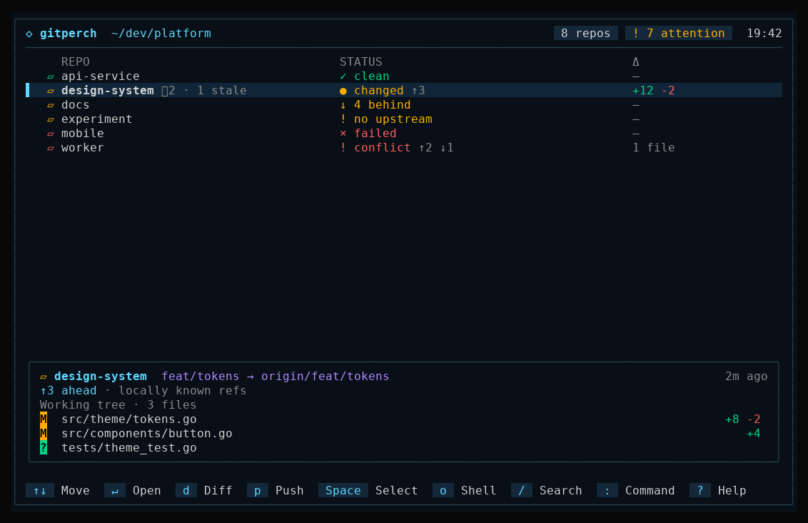

<div align="center">

<picture>
  <source media="(prefers-color-scheme: dark)" srcset="docs/assets/logo-dark.svg">
  
</picture>

# gitperch

**A terminal Git dashboard for keeping watch over the many repositories your AI coding agents work in.**

[](https://github.com/mark-lvl/gitperch/actions/workflows/ci.yml)
[](https://pkg.go.dev/github.com/mark-lvl/gitperch)
[](LICENSE)



</div>

## Why gitperch?

Agentic development spreads work out. Claude Code, Codex, Aider, Cursor and
similar tools edit many repositories and worktrees at once, often in parallel,
and often while you are looking at something else. Afterwards you need to know,
fast:

- Which repositories did agents leave **dirty, conflicted or mid-operation**?
- Which branches are **ahead, behind or diverged** from their upstream?
- Which **linked worktrees** exist, and what state are they in?
- What can be **safely fetched, pushed or fast-forwarded** right now?

gitperch is your perch above all of it: one keyboard-driven screen that
discovers every repository under your project roots, ranks the ones that need
attention, and lets you review and synchronize them without visiting each
directory.

It is deliberately conservative. Agents generate a lot of change; the
dashboard you use to review that change should never add surprises.
gitperch is read-only by default, never force-pushes, never commits, stashes
or resets, and re-validates every action right before it runs.

## Features

- **Workspace discovery**: recursive scan of one or more roots with depth
  limits, ignored directories, symlink safety and linked-worktree support.
- **Attention-first overview**: changes, untracked files, conflicts, branch,
  upstream and ahead/behind counts for every repository, sorted by what needs
  you first.
- **Worktree inventory**: every linked worktree, including nested, outside-root
  and stale ones, grouped under its repository.
- **Repository details**: overview, changed files, recent commits and worktree
  state, plus a diff view.
- **Safe synchronization**: fetch, push and fast-forward-only pull across a
  selection, each with a reviewed plan, revalidation and per-repository results.
- **Fast navigation**: fuzzy command palette (`:` / `Ctrl+K`), filtering,
  focus mode and multi-select.
- **Escape hatches**: open a shell or [LazyGit](https://github.com/jesseduffield/lazygit)
  in any repository and return to a refreshed dashboard.
- **Scriptable status**: `gitperch status` prints a plain table or versioned
  JSON for scripts, CI and agent tooling.
- **Hardened Git execution**: no shell interpolation, bounded output and
  deadlines, no interactive credential prompts, control characters escaped and
  credentials in URLs redacted.

## How it compares

gitperch sits between single-repository Git clients and multi-repository
command runners: it gives you a live overview of many repositories and a small,
guarded set of sync actions, and leaves everything else to the tools below.

| Tool | Interface | What it is for |
| --- | --- | --- |
| **gitperch** | TUI + plain/JSON status | Overseeing many repositories and worktrees; fetch, push and fast-forward-only pull after review |
| [lazygit](https://github.com/jesseduffield/lazygit) | TUI | Working inside one repository: staging, committing, rebasing |
| [gita](https://github.com/nosarthur/gita) | CLI | Side-by-side status of registered repositories and running commands across them |
| [myrepos](https://myrepos.branchable.com/) (`mr`) | CLI | Running commands across repositories listed in a config file, for several VCSs |
| [multi-git-status](https://github.com/fboender/multi-git-status) | CLI | One-shot report of uncommitted, unpushed and unpulled changes under a directory |

Choose gitperch when you want to see at a glance which of many repositories
need attention, especially ones that AI agents have been working in, without
registering each repository by hand or risking a command that rewrites history.
It discovers repositories and linked worktrees by scanning your roots, ranks
them by what needs you first, and deliberately cannot commit, stash, reset,
rebase or force-push. When you need to do real work in a repository, it opens
lazygit or a shell there and refreshes when you return.

## Installation

gitperch requires the `git` CLI at runtime. Linux and WSL2 are the supported
platforms today; macOS and Windows are not yet validated.

Prebuilt Linux binaries (amd64 and arm64) are attached to each
[GitHub release](https://github.com/mark-lvl/gitperch/releases). Download the
archive for your architecture and `checksums.txt`, then:

```sh
sha256sum --check --ignore-missing checksums.txt
tar -xzf gitperch_*_linux_amd64.tar.gz
install -m 0755 gitperch_*_linux_amd64/gitperch ~/.local/bin/
```

With Go 1.27.1 or newer:

```sh
go install github.com/mark-lvl/gitperch/cmd/gitperch@latest
```

From source:

```sh
git clone https://github.com/mark-lvl/gitperch.git
cd gitperch
make build          # writes bin/gitperch
```
## Quick start

```sh
gitperch ~/projects                   # interactive dashboard
gitperch status ~/projects            # plain table, no TUI
gitperch status --json ~/projects     # JSON for scripts and agents
```

Inside the dashboard:

| Key | Action |
| --- | --- |
| `↑`/`↓`, `j`/`k` | Move |
| `Enter` | Repository details |
| `d` | Changes / diff |
| `Space`, `a` | Select one / all visible |
| `f` | Fetch selected |
| `p` / `l` | Push / fast-forward pull (after one confirmation) |
| `/` | Filter by name, path or branch |
| `:` or `Ctrl+K` | Command palette |
| `o` | Open a shell in the repository |
| `r` | Refresh |
| `?` | Help |
| `q` | Quit |

Try it without touching your own repositories:

```sh
demo_root=$(bash scripts/demo.sh)
bin/gitperch "$demo_root/workspace"
```

## Configuration

gitperch reads `$XDG_CONFIG_HOME/gitperch/config.toml` (or
`~/.config/gitperch/config.toml`). Without a config file it scans the current
directory.

```toml
default_workspace = "agents"

[[workspace]]
name = "agents"
paths = ["~/projects", "~/agent-worktrees"]
max_depth = 4
ignore_dirs = ["node_modules", "vendor", "target", ".cache", ".next", "dist", "build"]

[ui]
icons = "unicode"     # or "ascii", "nerd"
refresh_seconds = 30  # automatic local status refresh; 0 turns it off
```

```sh
gitperch --workspace agents
```

See the [usage guide](docs/usage.md) for every option, exit code and safety
rule.

## Documentation

- [Usage guide](docs/usage.md): commands, configuration, fetch/push/pull rules,
  authentication and limits
- [Interface guide](docs/ui.md): layouts, key bindings and render captures
- [Development guide](docs/development.md): building, testing and project layout
- [Releasing](docs/releasing.md): versioning, changelog and the release workflow
- [Changelog](CHANGELOG.md): changes in each version
- [Design plan](docs/plan.md) and [mission control notes](docs/mission-control.md)

## Roadmap

gitperch currently shows what Git knows. Agent-aware views are the next step,
and will only be added on top of real integrations, not guessed from
heuristics:

- Show which agent session is active in which repository or worktree.
- Surface "waiting for review" and "agent finished" states next to Git status.
- Run project checks (tests, linters) from the dashboard.
- Validated macOS and Windows support, with release binaries for both
  (Linux binaries are already published).

Ideas and use cases are welcome in
[GitHub Discussions](https://github.com/mark-lvl/gitperch/discussions)
or as a [feature request](https://github.com/mark-lvl/gitperch/issues/new/choose).

## Contributing

Contributions are welcome, including ones written with AI agents. Read
[CONTRIBUTING.md](CONTRIBUTING.md) to get started; agents should also follow
[AGENTS.md](AGENTS.md). Everyone taking part is expected to follow the
[Code of Conduct](CODE_OF_CONDUCT.md).

To report a vulnerability, follow the [security policy](SECURITY.md) instead
of opening a public issue.

## License

gitperch is released under the [MIT License](LICENSE).
